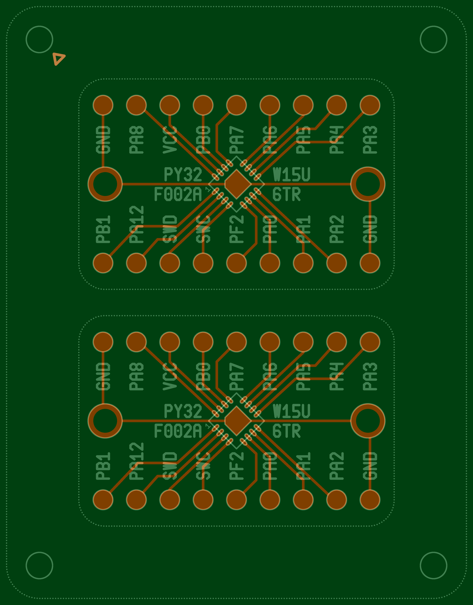

## PoC for fast prototyping PCBs using fiber laser

### Generated LightBurn files

* Etch
* Mask
* Stencil
* Part Positioner

### Example Overview

* Red: copper layer
* Dark green: FR4
* Light green: soldermask cuts / marks (silkscreen)
* White: stencil cuts

