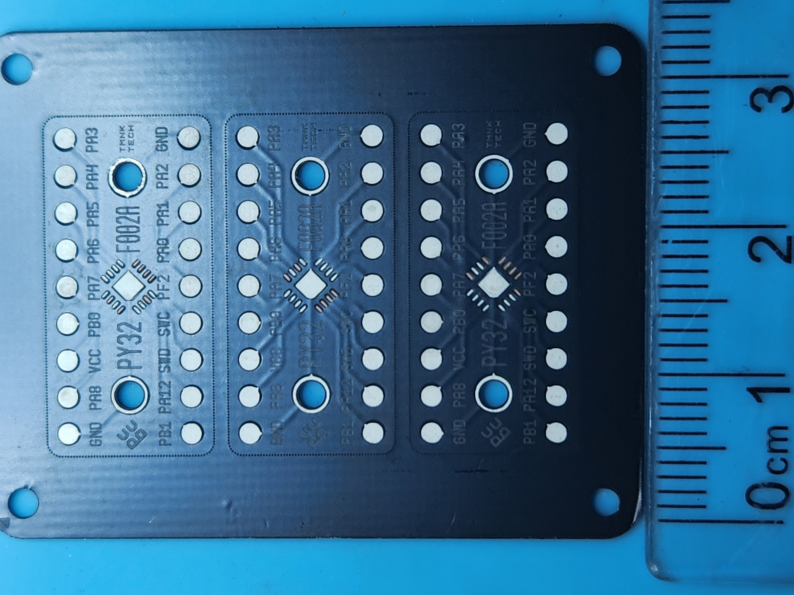
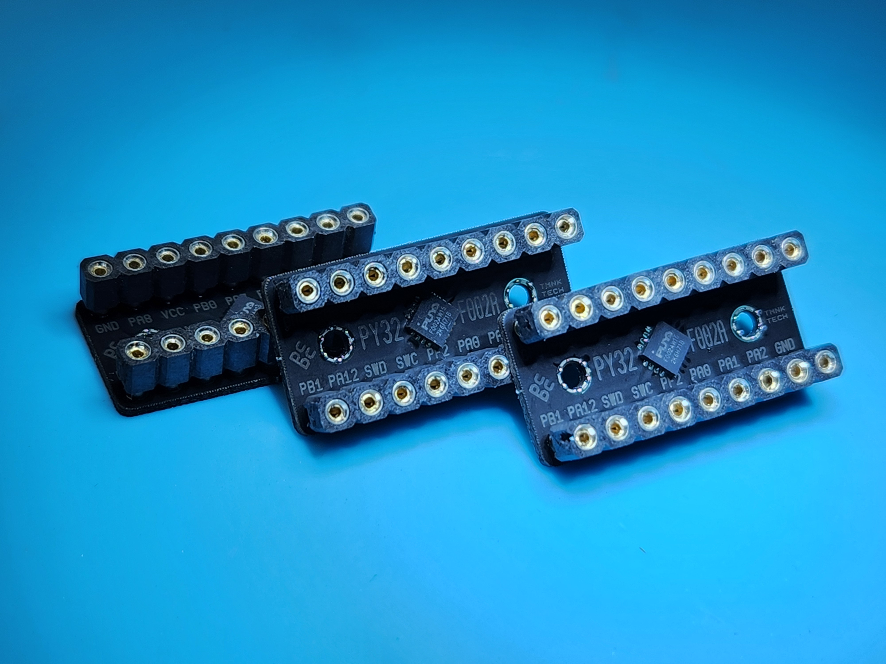

## PoC for fast prototyping PCBs using fiber laser

### Generated LightBurn files

* Etch
* Mask
* Stencil

### Example Overview

* Dark green: FR4
* Bright Green: FR4 cuts
* Orange: copper
* Blue: soldermask cuts
* Pale Green: soldermask marks (silkscreen)
* White: stencil cuts

