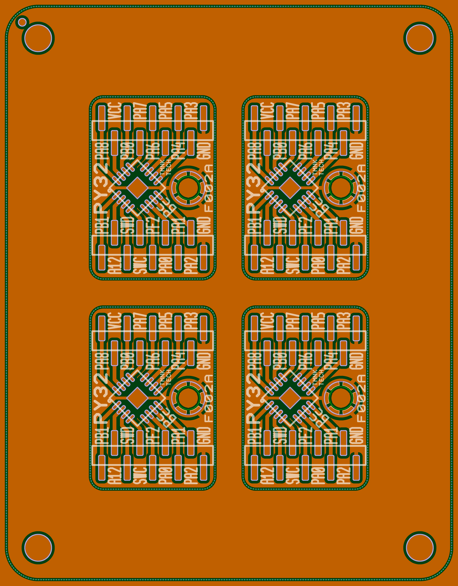
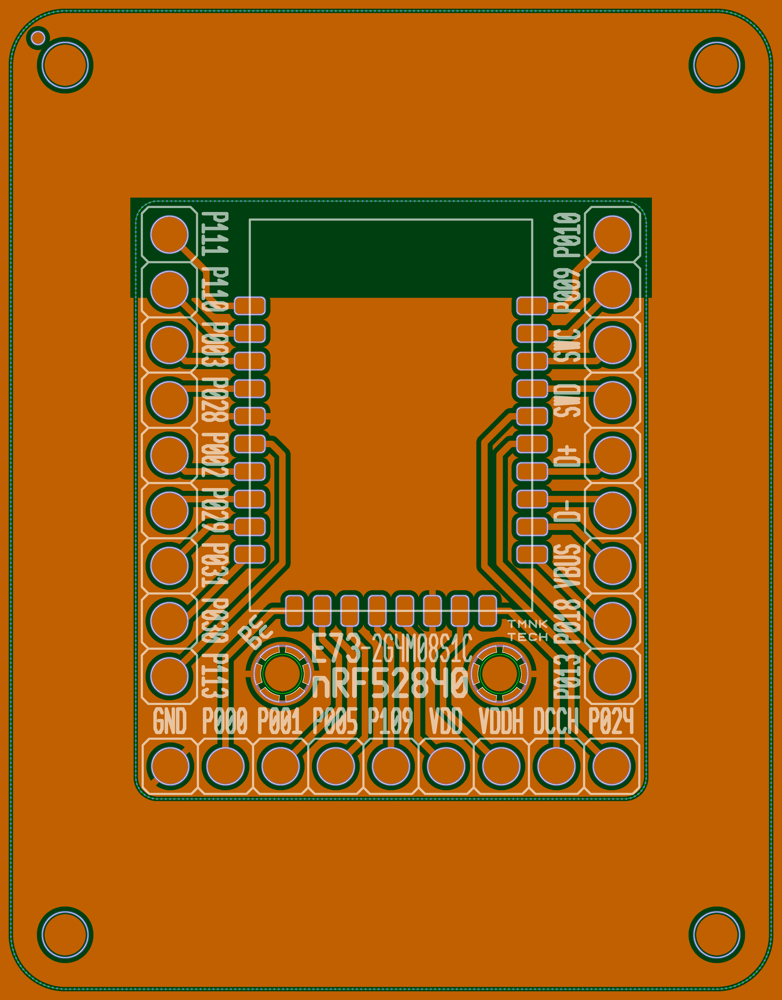
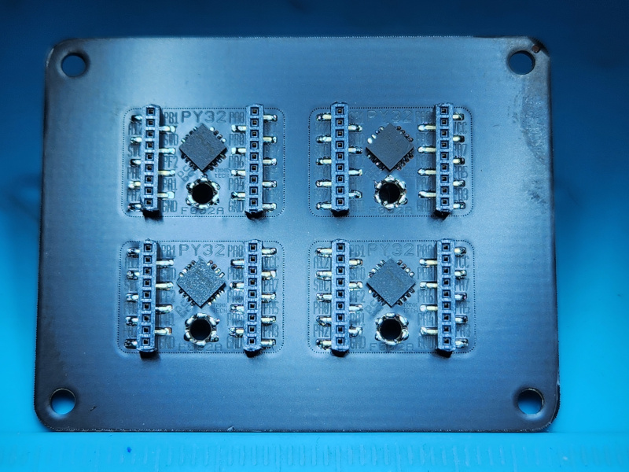
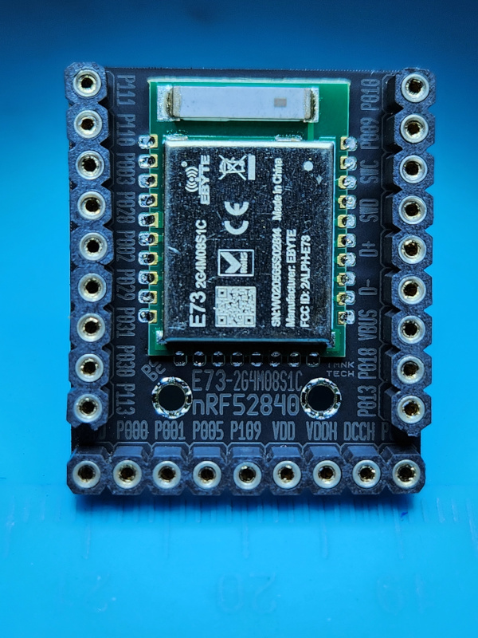
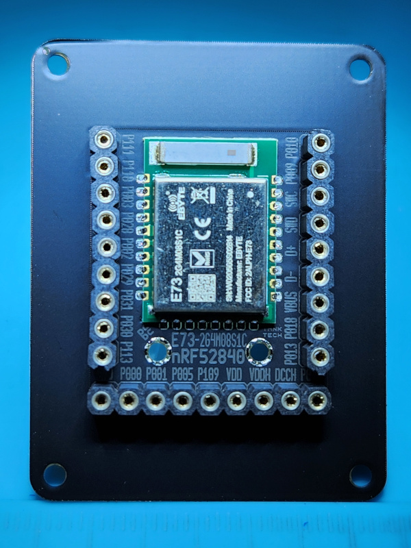
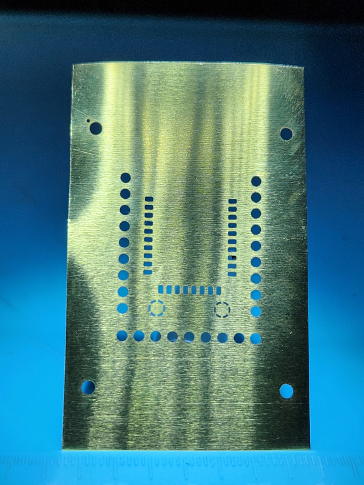
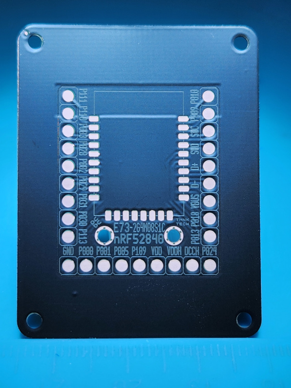
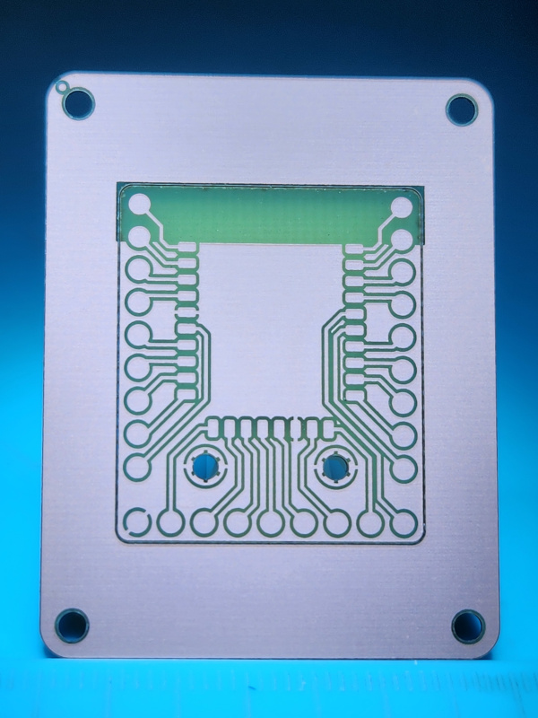
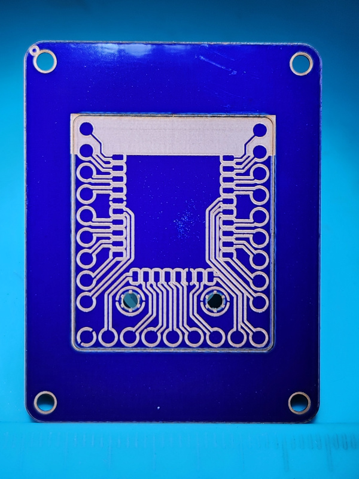

##### Copyright © 2025 Alex Temnok. All rights reserved.


## PCBC: fast PCB prototyping with a fiber laser

### Usage Example

```go
func main() {
	err := eda.GeneratePCBAt(&eda.Component{
		Components: eda.Components{
			pcbc.Board35x45,
			eda.ComponentGrid(3, 11, 5,
				x2.X2("LED+", "R2V-"),
				x2.X2("LED+", "G3V-"),
				x2.X2("LED+", "B3V-"),
				x2.X2("LED+", "Y2V-"),
				x2.X2("LED+", "W3V-"),
				x2.X2("R ", "50R"),
				x2.X2("R ", "50R"),
				x2.X2("R ", "K10"),
				x2.X2("R ", "K10"),
				x2.X2("R ", "K15"),
				x2.X2("R ", "K15"),
				x2.X2("R ", "K20"),
				x2.X2("R ", "K20"),
				x2.X2("R ", "K25"),
				x2.X2("R ", "K25"),
			).Arrange(transform.Rotate(90)),
		},
	}, "out/")

	if err != nil {
		log.Fatal(err)
	}
}
```

### Tiny Breakout Board Implementation Examples

* PY32 QFN16: [eda/pcbc/puya/qfn16/board.go](eda/pcbc/puya/qfn16/board.go)
* EBYTE E73: [eda/pcbc/ebyte/e73/board.go](eda/pcbc/ebyte/e73/board.go)
* Various 0603 components: [eda/pcbc/x2/x2.go](eda/pcbc/x2/x2.go)

### Generated LightBurn files

* Etch
* Mask
* Stencil

### Generated Overview (Combined Layers)

* Dark green: FR4
* Cyan: FR4 cuts
* Orange: copper
* Blue: soldermask cuts
* Pale Green/White: soldermask marks (silkscreen)
* Bright White: stencil cuts





### Gallery









