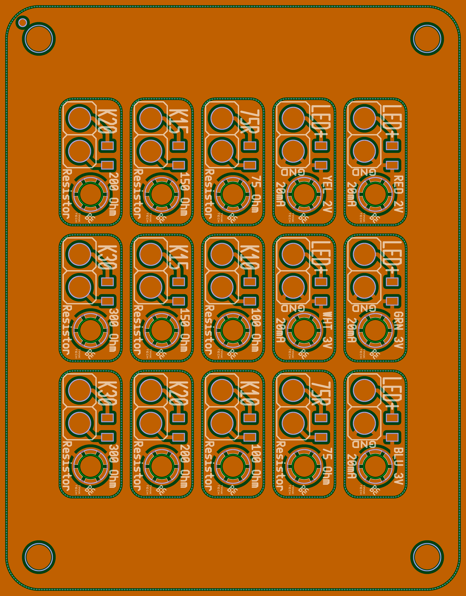

##### Copyright © 2025 Alex Temnok. All rights reserved.


## PCBC: fast PCB prototyping with a fiber laser

### Usage Example

```go
import (
    "github.com/temnok/pcbc/eda"
    "github.com/temnok/pcbc/eda/boards/p2"
    "github.com/temnok/pcbc/eda/pcb"
    "github.com/temnok/pcbc/eda/pcb/config"
    "log"
)

func main() {
    conf := config.Default()
    conf.Width, conf.Height = 40, 30

    err := pcb.Process(conf, &eda.Component{
        Nested: eda.Components{
            eda.ComponentGrid(3, 11, 5,
                p2.P2_I0402("LED+", "R2V-"),
                p2.P2_I0402("LED+", "G3V-"),
                p2.P2_I0402("LED+", "B3V-"),
                p2.P2_I0402("LED+", "Y2V-"),
                p2.P2_I0402("LED+", "W3V-"),
                p2.P2_I0402("R ", "50R"),
                p2.P2_I0402("R ", "50R"),
                p2.P2_I0402("R ", "K10"),
                p2.P2_I0402("R ", "K10"),
                p2.P2_I0402("R ", "K15"),
                p2.P2_I0402("R ", "K15"),
                p2.P2_I0402("R ", "K20"),
                p2.P2_I0402("R ", "K20"),
                p2.P2_I0402("R ", "K25"),
                p2.P2_I0402("R ", "K25"),
            ),
        },
    })

    if err != nil {
        log.Fatal(err)
    }
}
```

### Tiny Breakout Board Implementation Examples

* PY32 QFN16: [eda/boards/puya/qfn16/board.go](eda/boards/puya/qfn16/board.go)
* EBYTE E73: [eda/boards/ebyte/e73/board.go](eda/boards/ebyte/e73/board.go)
* Various 0402 components: [eda/boards/p2/p2.go](eda/boards/p2/p2.go)

### Generated LightBurn files

* Etch
* Mask
* Stencil

### Generated Overview (Combined Layers)

* Dark green: FR4
* Cyan: FR4 cuts
* Orange: copper
* Blue: soldermask cuts
* Pale Green/White: soldermask marks (silkscreen)
* Bright White: stencil cuts




### Gallery


